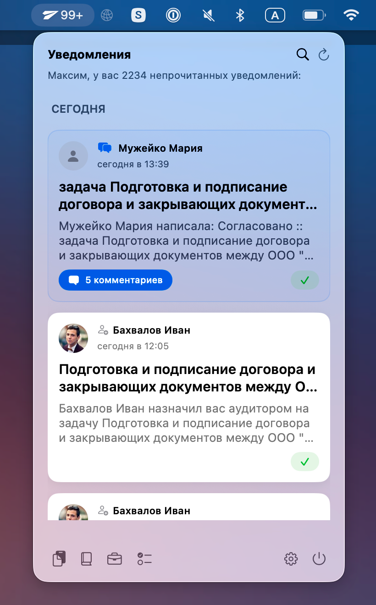
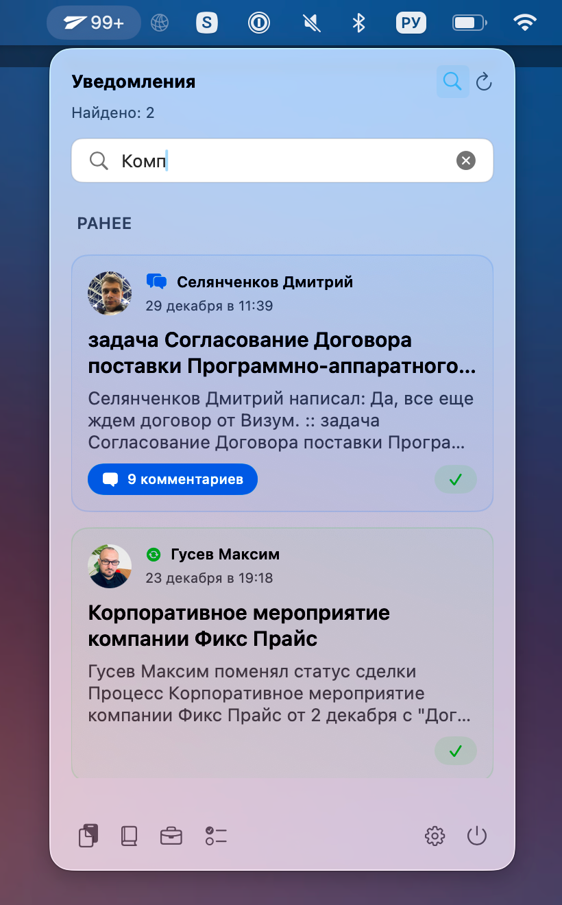
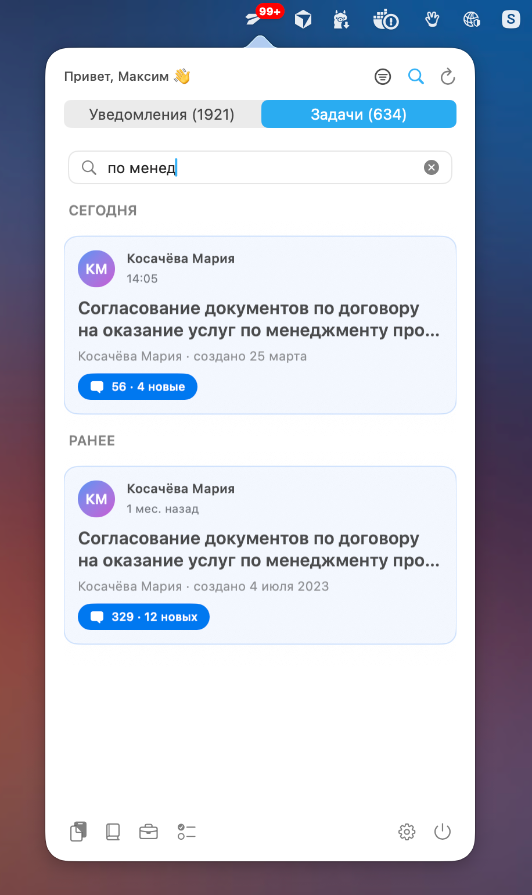

# Megaplan Helper

Меню-бар приложение для macOS, позволяющее получать уведомления из Мегаплана прямо из строки меню.

## Описание

Megaplan Helper — это нативное macOS-приложение, которое отображает уведомления из системы Мегаплан в строке меню. Приложение показывает количество непрочитанных уведомлений на иконке и позволяет быстро просматривать их без необходимости открывать браузер.

<table>
  <tr>
    <td align="center">
      <a href="screenshots/scr-01.png" target="_blank">
        
      </a>
    </td>
    <td align="center">
      <a href="screenshots/scr-02.png" target="_blank">
        
      </a>
    </td>
    <td align="center">
      <a href="screenshots/scr-03.png" target="_blank">
        
      </a>
    </td>
  </tr>
</table>

## Возможности

- Получение уведомлений в реальном времени — автоматическая проверка новых уведомлений
- Бейдж на иконке — отображение количества непрочитанных уведомлений
- Безопасное хранение — учетные данные хранятся в macOS Keychain
- Поддержка светлой и тёмной темы — адаптивные иконки для macOS
- Настраиваемый интервал обновления — от 30 секунд до 10 минут
- Автозапуск — возможность запуска приложения при входе в систему
- Быстрый доступ — контекстное меню для быстрого управления

## Технологии

- SwiftUI — современный UI framework от Apple
- Combine — реактивное программирование для обновлений
- ServiceManagement — управление автозапуском
- Keychain Services — безопасное хранение паролей

## Архитектура

### Структура проекта

```
MegaplanMenuBarApp/
├── AppState.swift              # Главное состояние приложения
├── MegaplanMenuBarApp.swift    # Точка входа
├── Models/
│   ├── MegaplanNotification.swift    # Модель уведомления
│   └── MegaplanCredentials.swift    # Модель учетных данных
├── Services/
│   ├── MegaplanAPI.swift      # API клиент для Мегаплана
│   └── KeychainManager.swift  # Управление Keychain
├── Views/
│   ├── AuthView.swift          # Окно авторизации
│   ├── NotificationListView.swift  # Список уведомлений
│   └── SettingsView.swift     # Окно настроек
└── Utils/
    ├── APILogger.swift        # Логирование API запросов
    ├── Constants.swift        # Константы приложения
    ├── HTMLCleaner.swift     # Очистка HTML из уведомлений
    ├── NetworkError.swift     # Обработка сетевых ошибок
    ├── SettingsWindowManager.swift  # Управление окнами
    └── StringExtensions.swift # Расширения для строк
```

### Архитектурные решения

- **MVVM** — отделение логики от представления
- **@MainActor** — все UI-операции на главном потоке
- **ObservableObject** — реактивные обновления UI
- **Combine** — таймеры и асинхронные операции
- **Keychain** — безопасное хранение токенов и паролей

### Основные компоненты

#### AppState
Центральное состояние приложения:
- Управление аутентификацией
- Загрузка уведомлений
- Настройка интервалов обновления
- Автозапуск приложения

#### MegaplanAPI
HTTP клиент для работы с API Мегаплана:
- Аутентификация через Basic Auth
- Загрузка уведомлений
- Отметка уведомлений как прочитанных

#### KeychainManager
Безопасное хранение данных:
- Сохранение access token
- Кеширование пароля для повторной аутентификации

## Сборка

### Требования

- macOS 13.0 или выше
- Xcode 14.0 или выше
- Swift 5.9

### Сборка проекта

#### Вариант 1: Универсальная сборка через скрипт (рекомендуется)

Для создания универсальной сборки, которая будет работать на любом Mac без Xcode:

```bash
./scripts/build-universal.sh
```

Скрипт создаст универсальный бинарник (arm64 + x86_64) в папке `build/export/`. Приложение будет готово к распространению. Скрипт автоматически обновляет build number перед сборкой.

#### Вариант 2: Сборка через Xcode

1. Откройте проект в Xcode:
```bash
open MegaplanHepler.xcodeproj
```

2. Выберите схему сборки:
   - Для универсального бинарника: **Product → Archive** (создаст универсальную сборку)
   - Для текущей архитектуры: **Product → Build** (Cmd+B)

3. **Настройте подпись (важно!):**
   
   **Для распространения без App Store:**
   - Откройте проект → Выберите таргет → "Signing & Capabilities"
   - **Отключите** "Automatically manage signing" (Personal Team не работает для Distribution)
   - Или оставьте включенным, но при экспорте выберите "Sign to Run Locally"

4. **Создайте дистрибутив:**
   - После Archive: **Window → Organizer → Distribute App**
   - Выберите **"Custom"** или **"Direct Distribution"**
   - На следующем шаге выберите **"Export"** (не "Upload")
   - На шаге настройки подписи:
     - **НЕ выбирайте команду** или выберите **"None"**
     - Выберите **"Sign to Run Locally"** (ad-hoc подпись) или **"Don't Sign"**
   - Нажмите **"Export"** и выберите папку для сохранения
   
   **Или используйте скрипт** (рекомендуется, работает без команды):
   ```bash
   ./scripts/build-universal.sh
   ```

#### Вариант 3: Командная строка (xcodebuild)

```bash
# Создание Archive
xcodebuild archive \
    -project MegaplanHepler.xcodeproj \
    -scheme MegaplanHepler \
    -configuration Release \
    -archivePath build/MegaplanHepler.xcarchive \
    -destination "generic/platform=macOS"

# Экспорт приложения
xcodebuild -exportArchive \
    -archivePath build/MegaplanHepler.xcarchive \
    -exportPath build/export \
    -exportOptionsPlist exportOptions.plist
```

### Важно для распространения

- ✅ Используйте **Release** конфигурацию (не Debug)
- ✅ Используйте **Archive** вместо обычной сборки
- ✅ Убедитесь, что включен **BUILD_LIBRARY_FOR_DISTRIBUTION = YES**
- ✅ Приложение должно быть подписано (Code Signing)

### GitHub Releases

Релизы автоматически публикуются в разделе [Releases](https://github.com/borzov/MegaplanHelper/releases) на GitHub при создании тега версии.

#### Создание нового релиза

1. **Обновите версию в проекте:**
   - Обновите `MARKETING_VERSION` в Xcode (например, 1.3)
   - Обновите Changelog в README.md

2. **Создайте коммит и тег:**
   ```bash
   git add .
   git commit -m "v1.3: Описание изменений"
   git tag -a v1.3 -m "Версия 1.3: Описание изменений"
   git push origin master
   git push origin v1.3
   ```

3. **Создайте GitHub Release:**
   ```bash
   gh release create v1.3 --title "v1.3 - Название релиза" --notes "Описание изменений из Changelog"
   ```

4. **Автоматическая сборка:**
   - GitHub Actions автоматически соберет универсальный бинарник
   - ZIP-архив с приложением будет прикреплен к релизу

#### Автоматизация через GitHub Actions

В проекте настроены GitHub Actions workflows:
- **`.github/workflows/build.yml`** — сборка при каждом push в master
- **`.github/workflows/release.yml`** — автоматическая сборка и публикация при создании тега версии

При создании тега `v*` (например, `v1.3`) автоматически:
- Собирается универсальный бинарник (arm64 + x86_64)
- Создается ZIP-архив с приложением
- Архив прикрепляется к GitHub Release

## Установка

1. Соберите приложение
2. Скопируйте скомпилированное приложение в `/Applications`
3. Запустите приложение
4. Введите данные для авторизации в Мегаплане

## Использование

### Авторизация

При первом запуске приложение запросит:
- **Домен** — адрес вашего сервера Мегаплана (например, `demo.megaplan.ru`)
- **Логин** — email адрес для входа
- **Пароль** — пароль от аккаунта

Данные авторизации безопасно хранятся в macOS Keychain.

### Просмотр уведомлений

Кликните на иконку в строке меню, чтобы открыть список уведомлений:
- Прочитанные уведомления автоматически синхронизируются
- Клик по уведомлению открывает его в браузере
- Кнопка "Отметить прочитанным" убирает уведомление из списка

### Настройки

Откройте настройки через контекстное меню:
- **Интервал обновления** — от 30 секунд до 10 минут
- **Автозапуск** — запуск приложения при входе в систему
- **Выход из аккаунта** — сброс всех данных авторизации

#### Технические детали
- Swift 5.9
- SwiftUI для UI
- Combine для реактивности
- ServiceManagement для автозапуска
- Deployment target: macOS 13.0+
- Universal binary (arm64 и x86_64)

## Changelog

### v1.4 (2025-01-16)
- Реорганизация скриптов сборки: перемещение в scripts/ и автоматическое обновление build number
- Улучшения безопасности и исправления багов
- Добавлены скриншоты приложения и обновлен README с превью

### v1.3
- Рефакторинг архитектуры: MVVM, новые сервисы и компоненты UI
- Добавлена функция поиска по уведомлениям с фильтрацией и улучшенным UI
- Добавлен эффект нажатия и визуальная индикация посещенных уведомлений
- Автоматизация GitHub Releases через GitHub Actions

### v1.2
- Рефакторинг кодовой базы и автоматизация build number

## Лицензия

Copyright © 2025-2026