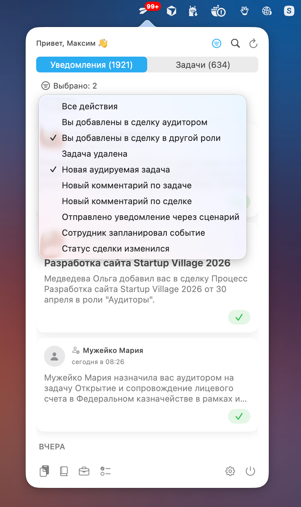

# Megaplan Helper

Нативное приложение для macOS, которое живет в строке меню и помогает работать с Мегапланом без постоянного переключения в браузер.

## Что это и зачем

Megaplan Helper показывает уведомления и задачи прямо из меню бара, держит под рукой непрочитанное и открывает нужную карточку в один клик. В релизной ветке 2.0 акцент сделан на удобстве ежедневной работы: стало проще входить, фильтровать поток и настраивать поведение приложения под себя.

<table>
  <tr>
    <td align="center">
      <a href="screenshots/scr-01.png" target="_blank">
        
      </a>
    </td>
    <td align="center">
      <a href="screenshots/scr-02.png" target="_blank">
        
      </a>
    </td>
  </tr>
  <tr>
    <td align="center">
      <a href="screenshots/scr-03.png" target="_blank">
        
      </a>
    </td>
    <td align="center">
      <a href="screenshots/scr-04.png" target="_blank">
        
      </a>
    </td>
  </tr>
</table>

## Ключевые возможности

- Уведомления и задачи в одном попапе с быстрым переключением вкладок.
- Умные фильтры, сортировка и поиск по задачам и уведомлениям.
- Отдельные индикаторы непрочитанного и комментариев по задачам.
- Двухшаговый мастер входа с проверкой домена перед авторизацией.
- Безопасное хранение учетных данных в macOS Keychain.
- Настраиваемые горячие клавиши, параметры кэша и поведения приложения.
- Автоматическое обновление данных по расписанию (интервал задается в настройках).

## Технологический стек

- Swift 5.9+
- SwiftUI
- Combine
- macOS 13+

## Архитектура

Проект следует MVVM-подходу и разделен на понятные зоны ответственности:

- `App/` - точка входа приложения и жизненный цикл.
- `Views/` - интерфейс (авторизация, попап, настройки).
- `ViewModels/` - состояние экранов и связка с сервисами.
- `Models/` - доменные модели Мегаплана и UI-состояния.
- `Services/` - API, кэширование, Keychain и вспомогательная бизнес-логика.
- `Utilities/` - расширения, константы и инфраструктурные хелперы.
- `Resources/` - ресурсы, локализация, ассеты.
- `scripts/` - скрипты сборки и релизные утилиты.

Для сети используется OAuth password grant через API Мегаплана. Токены и чувствительные данные не хранятся в открытом виде.

## Сборка

### Требования

- macOS 13.0 или новее
- Xcode 14.0 или новее

### Быстрая сборка (рекомендуется)

```bash
./scripts/build-universal.sh
```

Скрипт собирает универсальный `.app` (Apple Silicon + Intel) в `build/export/` и обновляет `CURRENT_PROJECT_VERSION`.

### Сборка через Xcode

```bash
open MegaplanHepler.xcodeproj
```

Дальше можно собирать через `Product -> Build` или `Product -> Archive`, в зависимости от сценария дистрибуции.

## Обновление версии и релиз

1. Обновите `MARKETING_VERSION` в `MegaplanHepler.xcodeproj/project.pbxproj`.
2. Актуализируйте `CHANGELOG.md`.
3. Создайте релизный коммит:

```bash
git add .
git commit -m "v2.0: Описание релиза"
```

4. Создайте и отправьте тег:

```bash
git tag -a v2.0 -m "Version 2.0: Описание релиза"
git push origin master
git push origin v2.0
```

После пуша тега workflow `.github/workflows/release.yml` автоматически собирает архив и публикует его в [GitHub Releases](https://github.com/borzov/MegaplanHelper/releases).

## Использование

1. Запустите приложение и введите домен рабочего пространства Мегаплана.
2. На следующем шаге введите логин и пароль.
3. Откройте попап через иконку в меню-баре:
   - вкладка «Уведомления» для входящих событий;
   - вкладка «Задачи» для текущих задач и комментариев.
4. В настройках подберите интервал обновления, поведение кэша и горячие клавиши.

## История изменений

Подробная история версий ведется в [CHANGELOG.md](CHANGELOG.md).

## Лицензия

Copyright © 2025-2026
